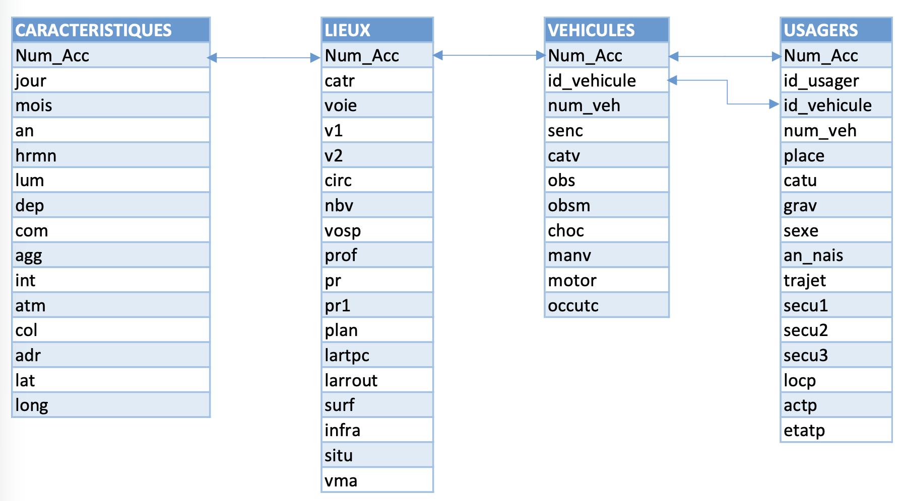
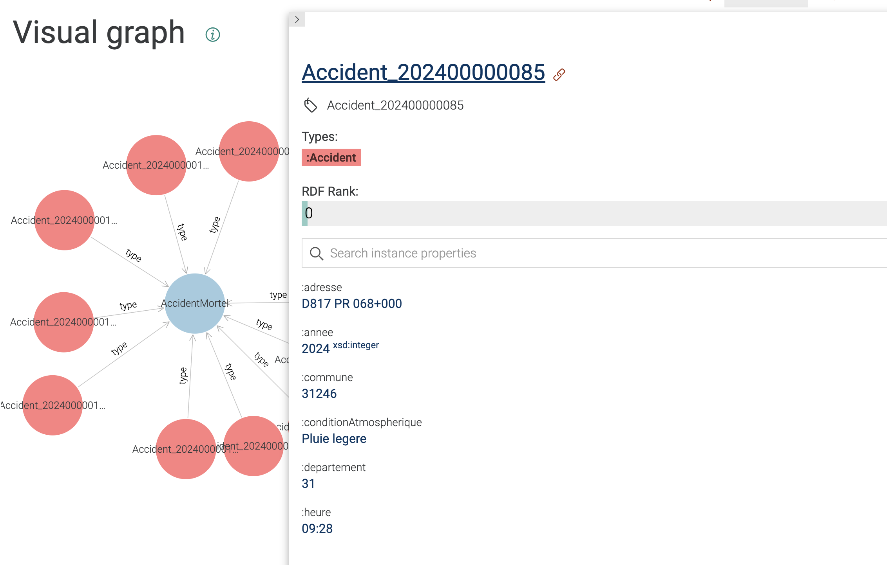

# Projet Web Sémantique - Accidents Routiers en France


**Master 2 Génie Informatique - IM2AG**  
*Université Grenoble Alpes*

[](https://github.com/idriss-ech/web-s-mantique)
[](https://github.com/idriss-ech/web-s-mantique/tree/dev)


---

## Réalisé par

- **Idriss Echakouki**  
- **Beandapa Yannick**  


[](https://github.com/idriss-ech)


---


## Description


Ce projet implémente une **ontologie sémantique complète** pour l'analyse des accidents routiers en France. Il transforme les données BAAC (Bulletin d'Analyse des Accidents Corporels) en graphe RDF, permettant des requêtes SPARQL avancées et une intégration avec DBpedia.


## Objectifs du Projet


- Créer une ontologie OWL complète pour les accidents routiers
- Convertir les données CSV en format RDF/Turtle
- Intégrer les données géographiques avec DBpedia
- Permettre des requêtes SPARQL complexes sur les données d'accidents


## Source des Données

[](https://www.data.gouv.fr/datasets/bases-de-donnees-annuelles-des-accidents-corporels-de-la-circulation-routiere-annees-de-2005-a-2024)

Les données proviennent de la **[base BAAC (Bulletins d'Analyse des Accidents Corporels)](https://www.data.gouv.fr/datasets/bases-de-donnees-annuelles-des-accidents-corporels-de-la-circulation-routiere-annees-de-2005-a-2024)** mise à disposition par le gouvernement français sur data.gouv.fr.

**Dataset utilisé :** Bases de données annuelles des accidents corporels de la circulation routière - **Année 2024 uniquement**

> **Note :** Ce projet se concentre exclusivement sur les données de l'année 2024. Le dataset complet couvre les années 2005 à 2024, mais seules les données 2024 ont été utilisées pour cette analyse.

Les fichiers de référence permettent de convertir les codes BAAC en libellés lisibles (ex: code "1" → "Plein jour" pour la luminosité).


## Analyse et Qualité des Données


Nous avons identifié **deux sources de données** sur les accidents routiers de 2024 et procédé à une analyse structurelle approfondie avant la modélisation.

### Nettoyage et Normalisation

**Hétérogénéités de Codage** : Les valeurs manquantes étaient représentées de manière inconsistante dans les données brutes :
- Codes `-1` ou `0` 
- Chaînes vides `""`
- Absence complète de valeur

**Solution adoptée** : Uniformisation en valeur nulle (absence de triplet RDF) pour éviter des faux signaux dans les requêtes SPARQL.

**Normalisation des Types** : Conversion explicite et rigoureuse des types de données :
- **Entiers** : jour, mois, année, gravité, luminosité, etc.
- **Chaînes** : heure (hrmn), adresse, identifiants
- **Décimaux** : coordonnées géographiques (latitude, longitude), largeurs

**Réduction du Volume** : Pour optimiser les performances et faciliter les tests :
- Conservation de **1/3 des données** du dataset complet
- Maintien de la représentativité statistique
- Obtention de temps de réponse SPARQL acceptables

### Limites de la Fusion Inter-sources

La fusion automatique des deux bases n'a pas été possible pour les raisons suivantes :

> [!WARNING]
> **Obstacles Techniques à la Fusion**

1. **Identifiants Non Correspondants** : Les identifiants d'accident (`Num_Acc`) ne correspondaient pas entre les deux sources.

2. **Attributs Discriminants Manquants** : La deuxième source manquait d'attributs critiques :
   - Heure précise de l'accident
   - Géolocalisation fine (latitude/longitude)
   
3. **Absence de Quasi-Identifiants** : Aucune combinaison stable de clés (date + lieu + véhicule) n'était simultanément présente et suffisamment complète dans les deux fichiers.

**Conséquence** : Nous avons choisi de travailler avec **une seule base de données** de qualité supérieure plutôt que de risquer une fusion inexacte.


## Construction de l'Ontologie


Nous avons suivi **deux approches parallèles** pour concevoir l'ontologie optimale :

### 1. Approche « Data-Driven » (Bottom-Up)

**Principe** : Dériver les classes et propriétés directement des colonnes observées dans les CSV.

**Méthode** :
- Groupement sémantique des attributs
- Identification des relations naturelles entre tables
- Mapping direct colonnes → propriétés RDF

**Avantages** :
- Couverture maximale des données (100% des champs BAAC)
- Alignement parfait avec la structure source

**Inconvénients** :
- Risque de sur-spécialisation aux structures tabulaires
- Moins de réutilisabilité et d'interopérabilité

### 2. Approche « Ontology-Driven » (Top-Down)

**Principe** : Partir d'une ontologie existante liée au domaine des accidents et l'adapter.

**Processus** :
1. **Élagage** : Suppression des classes/propriétés non utilisées
2. **Enrichissement** : Ajout de classes spécifiques manquantes
3. **Spécialisation** : Adaptation au contexte français (départements, communes)

**Avantages** :
- Alignement avec standards existants
- Meilleure interopérabilité future
- Hiérarchie claire et maintenable

### Décision Finale : Approche Hybride

Nous avons opté pour une **Data-Driven** en s'inspirant des avantages faites par **Ontology-Driven** :
Ces avantages sont d'avoir des caractéristiques contextuelles (luminosité, gravité, catégorie véhicule) en **datatype properties** plutôt que des classes séparées pour :
- Faciliter l'agrégation dans les requêtes SPARQL
- Éviter l'explosion du nombre de triplets


-> Critères de Choix Retenus
1. **Lisibilité et Maintenabilité** : Hiérarchie claire avec 4 classes principales
2. **Parcimonie** : Utilisation de datatype properties quand la granularité ne justifie pas une classe séparée
3. **Alignabilité** : Possibilité future de lier à des référentiels externes (DBpedia, GeoNames)


-> Le projet faite avec  l'approche « Ontology-Driven » (Top-Down) est dans le dossier "*projet_Approche_Data_Driven*"


## Ontologie


L'ontologie comprend **45 propriétés de données** couvrant **100%** des champs BAAC.

### Classes Principales

| Classe | Description | URI |
|--------|-------------|-----|
| `Accident` | Événement accidentel | `:Accident` |
| `Lieu` | Localisation et infrastructure | `:Lieu` |
| `Vehicule` | Véhicules impliqués | `:Vehicule` |
| `Usager` | Personnes impliquées | `:Usager` |

### Propriétés Objets

- `aLieu` : Accident → Lieu
- `impliqueVehicule` : Accident → Vehicule
- `impliqueUsager` : Accident → Usager
- `occupationVehicule` : Usager → Vehicule
- `departementDBpedia` : Accident → DBpedia Resource

### Namespaces Utilisés

```turtle
@prefix : <http://www.semanticweb.org/ontologies/accidents-routiers-v2#> .
@prefix owl: <http://www.w3.org/2002/07/owl#> .
@prefix rdf: <http://www.w3.org/1999/02/22-rdf-syntax-ns#> .
@prefix rdfs: <http://www.w3.org/2000/01/rdf-schema#> .
@prefix xsd: <http://www.w3.org/2001/XMLSchema#> .
@prefix foaf: <http://xmlns.com/foaf/0.1/> .
@prefix geo: <http://www.w3.org/2003/01/geo/wgs84_pos#> .
@prefix dbo: <http://dbpedia.org/ontology/> .
```


## Intégration DBpedia (Linked Data)


### Liaison avec les Départements Français

Nous avons enrichi notre graphe RDF en liant chaque accident à la ressource DBpedia du département correspondant via la propriété `departementDBpedia`.

**Exemple de triplet** :
```turtle
:Accident_2024001234 :departementDBpedia <http://fr.dbpedia.org/resource/Isère> .
```

### Données Enrichies Disponibles

Une fois lié à DBpedia, chaque département donne accès à :
- **Population totale** (`dbo:populationTotal`)
- **Superficie** (`dbo:areaTotal`)
- **Préfecture** (`dbo:capital`)
- **Région administrative**
- **Liens Wikipédia** et autres ressources

### Requêtes Fédérées SPARQL

Grâce au SERVICE endpoint, nous pouvons interroger simultanément :
- Notre graphe local (accidents)
- DBpedia FR (données départementales)

Voir [Requête 3 : Intégration DBpedia](#requête-3--intégration-dbpedia-url-cliquable) pour un exemple concret.

### Tentatives et Limites

> [!NOTE]
> **Travaux Non Finalisés**

Nous avons également tenté de :
- Lier les coordonnées GPS (`latitude`, `longitude`) au vocabulaire **GEO** (WGS84)
- Les propriétés `:latitude` et `:longitude` sont des sous-propriétés de `geo:lat` et `geo:long`

**Raison** : Manque de temps pour finaliser l'alignement complet avec les ontologies géospatiales.


## Technologies & Outils


### Stack Technique

- **Langage** : Python 3.8+
- **Bibliothèque RDF** : RDFLib
- **Éditeur d'ontologie** : Protégé 5.x
- **Triplestore** : GraphDB / Apache Jena Fuseki
- **IDE** : Visual Studio Code
- **Gestion de versions** : Git & GitHub

---


## Architecture du Projet




Le projet se compose de **4 classes principales** interconnectées :

- **Accident**: Caractéristiques temporelles et géographiques de l'événement

- **Lieu**: Détails de la localisation et infrastructure routière

- **Véhicule**: Informations sur les véhicules impliqués

- **Usager**: Données sur les personnes impliquées

---


## Structure du Projet


```bash
projet/
├── ontology/
│   └── ontologi25.ttl          # Ontologie OWL complète
├── scripts/
│   └── csv25.py                # Script de conversion CSV → RDF
├── data/
│   ├── caract-2024.csv         # Caractéristiques des accidents
│   ├── lieux-2024.csv          # Données de localisation
│   ├── vehicules-2024.csv      # Informations véhicules
│   ├── usagers-2024.csv        # Données usagers
│   ├── ref-carac/              # Référentiels caractéristiques
│   ├── ref_lieux/              # Référentiels lieux
│   ├── ref-veh/                # Référentiels véhicules
│   └── ref-usag/               # Référentiels usagers
├── output/
│   └── accidents25.ttl         # Graphe RDF généré (sortie)
├── resultats_sparql/           # Résultats des requêtes SPARQL (CSV)
├── assets/                     # Images et documentation
└── README.md                   # Ce fichier
```

## Installation et Utilisation


### Prérequis
```bash
Python 3.8+
pip install rdflib
```

### Étapes d'exécution


**1. Cloner le projet**
```bash
git clone https://github.com/idriss-ech/web-s-mantique.git
cd web-s-mantique
git checkout dev
```

**2. Créer l'environnement virtuel**
```bash
python3 -m venv venv
source venv/bin/activate
# Windows: venv\Scripts\activate
```

**3. Installer les dépendances**
```bash
pip install rdflib
```


**4. Générer le graphe RDF**
```bash
python scripts/csv25.py
```


**Résultat :** Le fichier `output/accidents25.ttl` est créé avec le graphe RDF complet


## Mapping CSV vers RDF : Méthodologie


Le script [`scripts/csv25.py`](scripts/csv25.py) effectue le mapping complet des fichiers CSV vers le graphe RDF en suivant une méthodologie rigoureuse.

### Approche Adoptée

#### 1. Normalisation des Identifiants (IRIs Stables)

Chaque entité reçoit une IRI unique et stable construite à partir de :
- **Classe de l'entité** (Accident, Lieu, Vehicule, Usager)
- **Identifiant primaire** de la table source

**Exemples d'IRIs** :
```turtle
:Accident_2024001234 rdf:type :Accident .
:Lieu_2024001234 rdf:type :Lieu .
:Vehicule_2024001234_01 rdf:type :Vehicule .
:Usager_2024001234_01_001 rdf:type :Usager .
```

#### 2. Typage RDF Basé sur la Source

Le type RDF (`rdf:type`) est automatiquement assigné selon la table CSV source :

| Fichier CSV | Classe RDF | Exemple IRI |
|-------------|-----------|-------------|
| `caract-2024.csv` | `:Accident` | `:Accident_2024XXXXXX` |
| `lieux-2024.csv` | `:Lieu` | `:Lieu_2024XXXXXX` |
| `vehicules-2024.csv` | `:Vehicule` | `:Vehicule_2024XXXXXX_YY` |
| `usagers-2024.csv` | `:Usager` | `:Usager_2024XXXXXX_YY_ZZZ` |

#### 3. Alignement Colonnes → Data Properties

Chaque colonne CSV est mappée vers une propriété de données de l'ontologie :

**Exemple : Fichier caracteristiques.csv**
```python
# Colonne CSV → Propriété RDF
jour → :jour (xsd:integer)
mois → :mois (xsd:integer)
an → :annee (xsd:integer)
hrmn → :heure (xsd:string)
lum → :luminosite (xsd:integer)  # Code transformé en libellé
dep → :departement (xsd:string)
lat → :latitude (xsd:decimal)
long → :longitude (xsd:decimal)
```

#### 4. Relations Inter-Tables (Object Properties)

Le script reconstruit les relations entre entités via les clés étrangères :

```turtle
# Accident → Lieu
:Accident_2024001234 :aLieu :Lieu_2024001234 .

# Accident → Vehicule
:Accident_2024001234 :impliqueVehicule :Vehicule_2024001234_01 .

# Accident → Usager
:Accident_2024001234 :impliqueUsager :Usager_2024001234_01_001 .

# Usager → Vehicule (occupation)
:Usager_2024001234_01_001 :occupationVehicule :Vehicule_2024001234_01 .
```

### Conversion des Codes BAAC en Libellés Lisibles

Les fichiers de référence (`data/ref-*/`) permettent de convertir les codes numériques en libellés complets.

#### Fichiers de Référence Utilisés

- `ref-carac/` : Luminosité, intersection, conditions atmosphériques, collisions
- `ref_lieux/` : Catégorie route, régime circulation, surface, infrastructure
- `ref-veh/` : Catégorie véhicule, obstacles, manœuvres, motorisation
- `ref-usag/` : Catégorie usager, gravité, sexe, motif déplacement, équipements

#### Exemple de Transformation

**Données brutes CSV** :
```csv
Num_Acc,lum,atm,col
2024001234,1,1,2
```

**Triplets RDF générés** :
```turtle
:Accident_2024001234 
    :luminosite "Plein jour" ;
    :conditionAtmospherique "Normale" ;
    :typeCollision "Deux véhicules - par l'arrière" .
```

> [!TIP]
> **Avantage des Libellés**
> 
> Les requêtes SPARQL retournent directement des résultats lisibles sans nécessiter de jointures supplémentaires avec des tables de référence.

### Gestion des Valeurs Manquantes

Stratégie de gestion :
- **Valeurs nulles/vides** : Aucun triplet généré (absence d'information)
- **Codes invalides** : Triplet avec valeur brute + log d'avertissement
- **Champs optionnels** : Vérification de présence avant génération


## Requêtes SPARQL : Fusion et Analyse


Le graphe RDF résultant permet d'exécuter des requêtes SPARQL complexes pour :
1. **Analyser les patterns d'accidents** (distribution temporelle, géographique, démographique)
2. **Fusionner les données** des 4 tables dans un même graphe interrogeable
3. **Enrichir via DBpedia** (données démographiques des départements)
4. **Détecter des corrélations** (météo vs gravité, infrastructure vs type collision)

### Objectifs des Requêtes

- **Distribution spatiale** : Identifier les zones à risque (départements, types de routes)
- **Corrélation usagers × gravité × véhicules** : Profiler les accidents mortels
- **Analyse temporelle** : Pics horaires, saisonnalité
- **Enrichissement externe** : Lier population/superficie via DBpedia pour calculer des taux d'accidents


## Exemples de Requêtes SPARQL


### Requête 1 : Accidents par département

```sparql
PREFIX : <http://www.semanticweb.org/ontologies/accidents-routiers-v2#>

SELECT ?accident ?dept (COUNT(?usager) as ?nbUsagers)
WHERE {
  ?accident a :Accident ;
            :departement ?dept ;
            :impliqueUsager ?usager .
}
GROUP BY ?accident ?dept
ORDER BY DESC(?nbUsagers)
LIMIT 10
```

📊 [Voir les résultats](resultats_sparql/accidents_par_departement.csv)

### Requête 2 : Données piétons

```sparql
PREFIX : <http://www.semanticweb.org/ontologies/accidents-routiers-v2#>

SELECT ?usager ?localisation ?action ?etat
WHERE {
  ?usager a :Usager ;
          :categorieUsager "Piéton" ;
          :localisationPieton ?localisation ;
          :actionPieton ?action ;
          :etatPieton ?etat .
}
LIMIT 50
```

📊 [Voir les résultats](resultats_sparql/donnees_pietons.csv)

### Requête 3 : Intégration DBpedia (URL Cliquable)

**Important :** Cette requête retourne l'**URI DBpedia cliquable** du département !

```sparql
PREFIX : <http://www.semanticweb.org/ontologies/accidents-routiers-v2#>
PREFIX dbo: <http://dbpedia.org/ontology/>
PREFIX rdfs: <http://www.w3.org/2000/01/rdf-schema#>

SELECT ?accident ?dbpediaDept ?deptName ?population ?superficie 
WHERE {
  ?accident a :Accident ;
            :departementDBpedia ?dbpediaDept .
  
  SERVICE <http://fr.dbpedia.org/sparql> {
    ?dbpediaDept rdfs:label ?deptName ;
                 dbo:populationTotal ?population ;
                 dbo:areaTotal ?superficie .
    FILTER(lang(?deptName) = "fr")
  }
}
LIMIT 20
```

> **Note :** La colonne `?dbpediaDept` contient l'URI cliquable (ex: `http://fr.dbpedia.org/resource/Guadeloupe`) que vous pouvez cliquer dans GraphDB/Protégé pour accéder aux données complètes du département sur DBpedia.

📊 [Voir les résultats](resultats_sparql/dbpedia_departements.csv)

### Requête 4 : Accidents mortels par condition météo

```sparql
PREFIX : <http://www.semanticweb.org/ontologies/accidents-routiers-v2#>

SELECT ?conditionAtmo (COUNT(?accident) as ?nbAccidents) 
       (COUNT(DISTINCT ?usagerDecede) as ?nbDeces)
WHERE {
  ?accident a :Accident ;
            :conditionAtmospherique ?conditionAtmo ;
            :impliqueUsager ?usagerDecede .
  ?usagerDecede :gravite "Tué" .
}
GROUP BY ?conditionAtmo
ORDER BY DESC(?nbDeces)
```

📊 [Voir les résultats](resultats_sparql/accidents_mortels_meteo.csv)

### Requête 5 : Types de véhicules impliqués

```sparql
PREFIX : <http://www.semanticweb.org/ontologies/accidents-routiers-v2#>

SELECT ?categorieVehicule (COUNT(?vehicule) as ?nombre)
WHERE {
  ?accident a :Accident ;
            :impliqueVehicule ?vehicule .
  ?vehicule :categorieVehicule ?categorieVehicule .
}
GROUP BY ?categorieVehicule
ORDER BY DESC(?nombre)
LIMIT 15
```

📊 [Voir les résultats](resultats_sparql/types_vehicules.csv)

### Requête 6 : Accidents selon la luminosité

```sparql
PREFIX : <http://www.semanticweb.org/ontologies/accidents-routiers-v2#>

SELECT ?luminosite (COUNT(?accident) as ?nbAccidents)
WHERE {
  ?accident a :Accident ;
            :luminosite ?luminosite .
}
GROUP BY ?luminosite
ORDER BY DESC(?nbAccidents)
```

📊 [Voir les résultats](resultats_sparql/accidents_luminosite.csv)

### Requête 7 : Accidents sur voies réservées (pistes cyclables)

```sparql
PREFIX : <http://www.semanticweb.org/ontologies/accidents-routiers-v2#>

SELECT ?accident ?voieReservee ?categorieRoute
WHERE {
  ?accident a :Accident ;
            :aLieu ?lieu .
  ?lieu :voieReservee ?voieReservee ;
        :categorieRoute ?categorieRoute .
  FILTER(?voieReservee != "")
}
LIMIT 50
```

📊 [Voir les résultats](resultats_sparql/accidents_voies_reservees.csv)

### Requête 8 : Profil des victimes (âge, sexe, gravité)

```sparql
PREFIX : <http://www.semanticweb.org/ontologies/accidents-routiers-v2#>

SELECT ?sexe ?gravite (COUNT(?usager) as ?nombre) 
       (AVG(2024 - ?anneeNaissance) as ?ageMoyen)
WHERE {
  ?accident a :Accident ;
            :impliqueUsager ?usager .
  ?usager :sexe ?sexe ;
          :gravite ?gravite ;
          :anneeNaissance ?anneeNaissance .
}
GROUP BY ?sexe ?gravite
ORDER BY ?sexe ?gravite
```

📊 [Voir les résultats](resultats_sparql/profil_victimes.csv)

### Requête 9 : Localisation et action des piétons

```sparql
PREFIX : <http://www.semanticweb.org/ontologies/accidents-routiers-v2#>

SELECT ?localisationPieton ?actionPieton ?etatPieton (COUNT(?pieton) as ?nombre)
WHERE {
  ?accident a :Accident ;
            :impliqueUsager ?pieton .
  ?pieton :categorieUsager "Piéton" ;
          :localisationPieton ?localisationPieton ;
          :actionPieton ?actionPieton ;
          :etatPieton ?etatPieton .
}
GROUP BY ?localisationPieton ?actionPieton ?etatPieton
ORDER BY DESC(?nombre)
LIMIT 20
```

📊 [Voir les résultats](resultats_sparql/pietons_localisation.csv)


### Requête 10 : CONSTRUCT Basique "Graph Simplifié des Accidents Mortels"

```sparql
PREFIX : <http://www.semanticweb.org/ontologies/accidents-routiers-v2#>
PREFIX rdf: <http://www.w3.org/1999/02/22-rdf-syntax-ns#>

CONSTRUCT {
  ?accident rdf:type :AccidentMortel ;
            :departement ?dept ;
            :luminosite ?lum ;
            :nbVictimes ?nbDeces .
}
WHERE {
  ?accident a :Accident ;
            :departement ?dept ;
            :impliqueUsager ?usager .
  ?usager :gravite "Tué" .
}
LIMIT 100
```


📊 [Voir les résultats](resultats_sparql/graph_simplifie_des_accidents_mortels.ttl)


## Documentation


- [Ontologie](ontology/ontologi25.ttl) - Fichier OWL complet
- [Script Python](scripts/csv25.py) - Code de conversion
- [Description des données](description-des-bases-de-donnees-annuelles.pdf) - Documentation BAAC

---


## Réalisé par

- **Idriss Echakouki**  
- **Beandapa Yannick**  

Master 2 Génie Informatique - IM2AG  
Université Grenoble Alpes

[](https://github.com/idriss-ech)


---

## Licence

Projet académique - M2 GI IM2AG 2024-2025

---


### Liens Utiles

[](https://github.com/idriss-ech/web-s-mantique)
[](https://github.com/idriss-ech/web-s-mantique/tree/dev)
[](https://www.data.gouv.fr)
[](http://fr.dbpedia.org)

---

**Web Sémantique** • **Ontologies OWL** • **RDF/SPARQL** • **Linked Data**

*Projet réalisé dans le cadre du cours de Web Sémantique*

